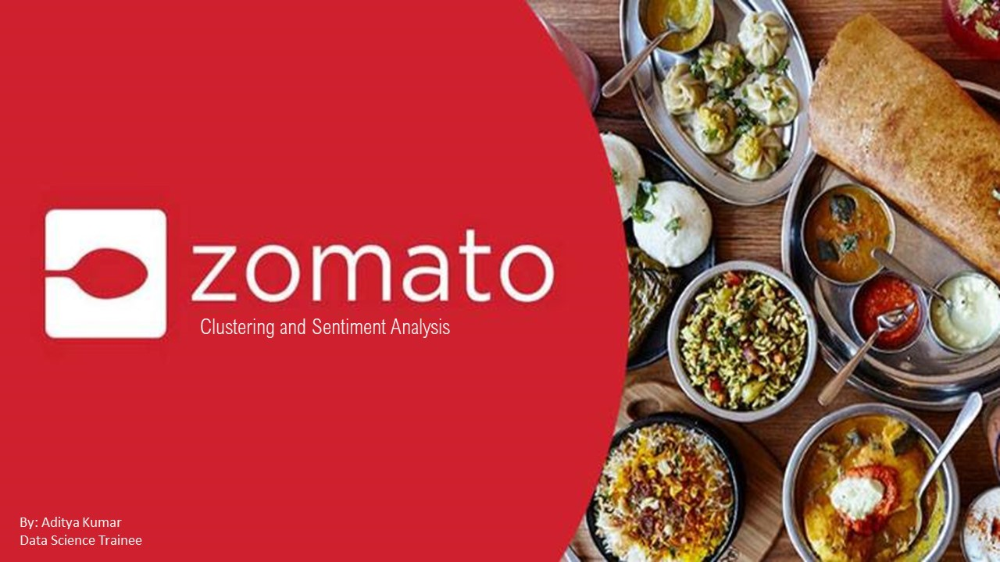

# [Zomato-Restaurant_Clustering_and_Sentiment_Analysis](https://colab.research.google.com/drive/1RKe9hnr0YLAWDUBy0VDRU7tlWgMFPptU?usp=sharing)

## 📌 Project Overview
This project focuses on analyzing the Indian food industry landscape using data from Zomato. By leveraging unsupervised machine learning (Clustering) and Natural Language Processing (Sentiment Analysis), the project aims to group similar restaurants and understand customer feedback patterns.

The insights gained help customers find the best restaurants in their locality and assist the company in identifying service gaps and areas for growth.

## 🛠️ Key Features
Data Cleaning & Preprocessing: Handling missing values in Collections and Timings, and converting Cost and Rating into numerical formats.

Exploratory Data Analysis (EDA): Visualizing top expensive/affordable restaurants, cuisine distribution, and reviewer patterns using 15+ logical charts.

Restaurant Clustering: Grouping restaurants based on location, cuisines, and average cost using K-Means and Agglomerative Hierarchical Clustering.

Sentiment Analysis: Classifying user reviews into positive and negative sentiments using LDA (Latent Dirichlet Allocation) for topic modeling and XGBClassifier for supervised prediction.

Recommendation System: A content-based filtering system that suggests restaurants based on user profiles and cuisine preferences.

## 📊 Dataset Description
The analysis is based on two primary datasets:

[Zomato Restaurant & Metadata](https://drive.google.com/file/d/1ZdRtAMFQ2leSD8WZBVG8ZTEHli1D7CF5/view?usp=sharing): Includes Name, Links, Cost, Cuisines, and Timings.

[Zomato Reviews](https://drive.google.com/file/d/1EZHHzEmIm9o4zsvRh4vo7PKMwJ4jQSjS/view?usp=sharing): Includes Restaurant name, Reviewer, Review text, Rating, Metadata (followers/reviews), and Time.## Dataset

## Installation
To run this project on your local machine, follow these steps:

         Copy the colab file into your drive.

         Run the colab file to gain insights.

## 🚀 Technologies Used
Language: Python

Libraries: Pandas, NumPy, Matplotlib, Seaborn

Machine Learning: Scikit-learn (K-Means, PCA, StandardScaler), XGBoost

NLP: NLTK (Lemmatization, Stopwords), Contractions, TF-IDF Vectorizer, WordCloud

Explainability: SHAP (SHapley Additive exPlanations)

## 📈 Major Insights
Cuisine Impact: Restaurants offering a higher variety of cuisines generally receive higher ratings (validated through Hypothesis Testing).

Cost vs. Rating: Statistical testing showed no strong linear relationship between the cost of a restaurant and its rating, suggesting that high-cost doesn't always guarantee high satisfaction.

Optimal Clusters: The elbow method and silhouette scores identified that 5 clusters provided the most meaningful segmentation of the restaurant market.

Sentiment Trends: Most customers hold a positive sentiment, though specific areas like "delivery time" or "portion size" were identified as common negative feedback topics in the word clouds.
## 🧪 Model Performance
        

## Conclusion
Clustering and sentiment analysis were performed on a dataset of customer reviews for the food delivery service Zomato.

The purpose of this analysis was to understand the customer's experience and gain insights about their feedback.

The clustering technique was applied to group customers based on their review text the customers were grouped into two clusters: positive and negative.

This provided a general understanding of customer satisfaction levels, with the positive cluster indicating the highest level of satisfaction and the negative cluster indicating the lowest level of satisfaction.

Sentiment analysis was then applied to classify the review text as positive or negative.

This provided a more detailed understanding of customer feedback and helped to identify specific areas where the service could be improved.

Overall, This analysis provided valuable insights into the customer's experience with Zomato, and it could be used to guide future business decisions and improve the service.

Additionally, by combining clustering and sentiment analysis techniques, a more comprehensive understanding of customer feedback was achieved.

## Data Insights
We figured out the top 10 most expensive restaurant in the given dataset , and they are :-

"Collage - Hyatt Hyderabad Gachibowli

Feast - Sheraton Hyderabad Hotel Jonathan's Kitchen - Holiday Inn Express & Suites 10 Downing Street Cascade - Radisson Hyderabad Hitec City Zega - Sheraton Hyderabad Hotel Republic Of Noodles - Lemon Tree Hotel Mazzo - Marriott Executive Apartments Arena Eleven Barbeque Nation"

We figured out the top 10 most Economical restaurant in the given dataset , and they are :-

"Mohammedia Shawarma

Amul Asian Meal Box Sweet Basket KS Bakers Momos Delight Hunger Maggi Point Wich Please Shah Ghouse Spl Shawarma Tempteys"

We figured out that their are different hotels which sells different types and number of cuisine among them, we have "hunger maggie point" who serves minimum number of cuisines and "Beyond Flavours" being the one serving maximum number of cuisines.

We could see that their are restuarants having high price are being equally reviwed or rated as bad and good, however we could see more data from 2018 and 2019 spread across.

we could conclude that zomato has some tagged collections which makes it easier for the user to get through the desired food they are looking for , so in order for the business to grow , the restaurant should focus to getting more tags from zomato and keep availability accordingly.

We could figure out that their are certain cuisine which are available only in certain months like healthy food , mexican , arabians , kebab.however most of the cuisines are available during all the months.

We found that , the reviewer that reviewed "Pista House" restaurant has the highest number of followers and one who reveiwed "Dunkin's Donuts" had lowest number among top 5 category.

We could see that their are restuarants having high price are being equally reviwed or rated as bad and good, however we could see more data from 2018 and 2019 spread across.

## 🤝 Contributing
Contributions, issues, and feature requests are welcome! Since this is an open-source project, feel free to check the issues page if you want to contribute or suggest improvements.
I'm always open to discussing data science projects, potential collaborations, or receiving feedback on this work.

**Thank you for visiting my repository! If you found this project helpful, please consider giving it a ⭐ to show your support.**
